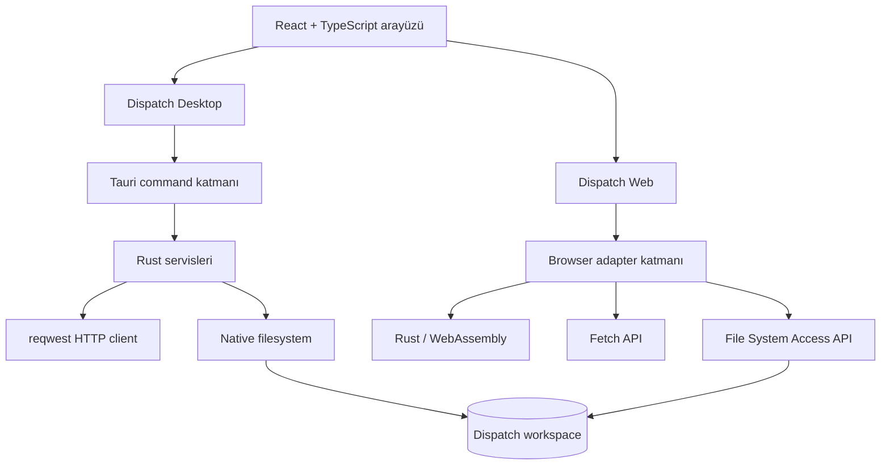
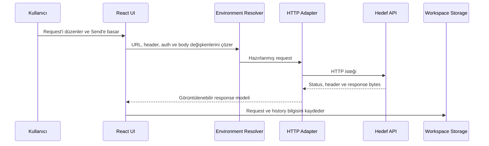

<div align="center">
  

  <h3>Desktop ve web üzerinde çalışan, local-first API geliştirme ortamı</h3>

  <p>
    HTTP isteklerini oluştur, collection ve environment'larını düzenle,
    OpenAPI dokümanlarını içe aktar ve aynı workspace'i masaüstü ile web arasında taşı.
  </p>

  <p>
    
    
    
    
    
    
  </p>
</div>

---

## Dispatch nedir?

Dispatch; Postman benzeri bir çalışma deneyimini, kullanıcının verilerini kendi seçtiği klasörde tutan taşınabilir bir workspace modeliyle birleştiren API istemcisidir.

Proje tek codebase'den iki çalışma hedefi üretir:

- **Dispatch Desktop:** Ortak React arayüzünü Tauri kabuğu ve Rust servisleriyle çalıştırır.
- **Dispatch Web:** Aynı React arayüzünü browser adapter'ları ve Rust/WebAssembly ile Chromium tabanlı tarayıcılarda çalıştırır.

Ayrı bir uygulama backend'i yoktur. Collection, environment ve workspace bilgileri kullanıcının cihazında saklanır. Desktop sürümü HTTP isteklerini Rust `reqwest` üzerinden, web sürümü ise tarayıcının `fetch` API'si üzerinden gönderir.

## Öne çıkan özellikler

| Alan | Desteklenen özellikler |
| --- | --- |
| HTTP istekleri | GET, POST, PUT, PATCH, DELETE, HEAD ve OPTIONS |
| Request body | JSON, düz metin, HTML, XML, form-data, x-www-form-urlencoded ve binary |
| Response görüntüleme | JSON, text, HTML, XML, görsel, ses, video, PDF ve binary içerikler |
| Organizasyon | Collection, iç içe folder, request sekmeleri ve request history |
| Environment | Environment seçimi, değişken yönetimi ve `{{variable}}` çözümleme |
| Authentication | Bearer Token, Basic Auth, API Key ve desktop'ta OAuth 2.0 Authorization Code + PKCE |
| OpenAPI | OpenAPI 3.0.x ve 3.1.x JSON/YAML import-export; request adlandırma ve tag/path organizasyonu |
| HTTP ayarları | Global varsayılanlar ve request bazlı override desteği |
| Workspace | Desktop ve web tarafından okunabilen, klasör tabanlı ortak veri sözleşmesi |
| Arşiv | Desktop'ta doğrulanan `.dispatch` backup ve güvenli paylaşım arşivleri |

## Desktop ve Web

| | Dispatch Desktop | Dispatch Web |
| --- | --- | --- |
| Çalışma ortamı | macOS, Windows ve Linux için Tauri | Chromium tabanlı tarayıcı / PWA |
| HTTP motoru | Rust `reqwest` | Browser `fetch` |
| Dosya erişimi | Tauri filesystem komutları | File System Access API |
| İş mantığı | Rust servisleri | Rust/WebAssembly + browser adapter'ları |
| CORS kısıtı | Yok | Hedef API'nin CORS iznine tabidir |
| OAuth 2.0 PKCE | Var | Tarayıcı güvenlik sınırları nedeniyle sınırlı |
| Workspace uyumluluğu | Var | Var |
| OpenAPI import-export | Var | Var |
| `.dispatch` arşivi | Var | Planlanan geliştirme |

> Web sürümünde klasör seçimi için File System Access API kullanıldığı için ilk sürüm Chromium tabanlı tarayıcıları hedefler. Tarayıcı, yalnızca kullanıcının açıkça izin verdiği klasöre erişebilir.

## Mimari



Desktop ve web aynı frontend, hook, tip ve UI component'lerini paylaşır. Build sırasında platform adapter'ı seçilir; iki hedef bağımsız artifact olarak dağıtılır ve aynı **workspace veri sözleşmesini** kullanır.

### Request akışı



## Workspace yapısı

Bir Dispatch workspace'i normal bir klasördür. Uygulamanın sahip olduğu özel veya gizli bir veritabanı formatı değildir.

```text
MyWorkspace/
├── dispatch.workspace.json
├── collections.json
├── environments.json
└── assets/                 # Workspace'e bağlı dosyalar (opsiyonel)
```

- `dispatch.workspace.json`: Workspace kimliği, adı ve format sürümü.
- `collections.json`: Collection, folder ve request ağacı.
- `environments.json`: Environment'lar ve değişkenleri.
- `assets/`: Request'lerde kullanılabilen workspace dosyaları.

Bu yapı sayesinde masaüstünde oluşturulan bir workspace klasörü daha sonra web sürümünde seçilip açılabilir.

## OpenAPI import ve export

Dispatch, OpenAPI dokümanını dosyadan veya doğrudan metin olarak analiz edebilir.

- JSON ve YAML desteği
- OpenAPI 3.0.x ve 3.1.x desteği
- Request isimlerini **path** veya **URL** üzerinden oluşturma
- Folder'ları **tag** veya **path** bilgisine göre düzenleme
- Server URL, path/query parametreleri, request body ve authentication bilgilerinin collection'a dönüştürülmesi
- Mevcut bir Dispatch collection'ının OpenAPI dokümanı olarak dışarı aktarılması

## `.dispatch` arşivi

Desktop uygulaması bir workspace'i tek bir `.dispatch` dosyasında paketleyebilir. Bu dosya, workspace JSON dosyalarını içeren doğrulanabilir bir ZIP arşividir.

- **Backup:** Workspace'in eksiksiz yedeğini üretir.
- **Safe Share:** Paylaşım öncesinde hassas environment değerlerini temizler.
- Import sırasında manifest, dosya yolları, boyutlar ve checksum değerleri doğrulanır.

## Proje yapısı

```text
Root/
├── Dispatch/              # Tek web + desktop codebase
│   ├── src/               # Ortak React UI ve platform adapter'ları
│   ├── rust/              # WebAssembly core ve wrapper
│   ├── src-tauri/         # Native Rust command, model ve servisler
│   └── docs/              # Workspace ve birleşik mimari dokümanları
├── TestBackend/           # Yerel geliştirme ve HTTP test servisi
└── storefront-sample.yaml # OpenAPI import örneği
```

## Kurulum

### Gereksinimler

- Güncel bir Node.js ve npm kurulumu
- Rust toolchain
- Desktop geliştirme için [Tauri sistem gereksinimleri](https://v2.tauri.app/start/prerequisites/)
- WebAssembly build'i için `wasm-pack`

### Dispatch

```bash
cd Dispatch
npm install
npm run tauri dev
```

Production build:

```bash
npm run tauri build
```

Web geliştirme:

```bash
rustup target add wasm32-unknown-unknown
cargo install wasm-pack
cd Dispatch
npm run dev:web
```

Production build:

```bash
npm run build:web
```

## Uygulamayı kullanma

1. Yeni bir workspace oluştur veya mevcut workspace klasörünü seç.
2. Bir collection ve request oluştur; istersen OpenAPI JSON/YAML dokümanını içe aktar.
3. URL, method, header, auth ve body bilgilerini düzenle.
4. Gerekirse bir environment seçerek `{{variable}}` değerlerini kullan.
5. Request'i gönder ve body, cookie, header, süre ve boyut bilgilerini response panelinde incele.

## Teknik notlar

- Desktop storage katmanı geçici dosyaya yazma ve atomik değiştirme yaklaşımı kullanır.
- Web sürümü klasör izinlerini tarayıcıdan alır; son kullanılan directory handle'ları IndexedDB'de tutulabilir ancak yeniden erişim için tarayıcı tekrar izin isteyebilir.
- Web request'leri tarayıcı güvenlik modeline tabidir. Hedef API uygun CORS header'larını sağlamıyorsa request tarayıcı tarafından engellenir.
- Safe Share arşivlerinde hassas environment değerleri boşaltılır; yine de paylaşmadan önce arşiv içeriğini kontrol etmek önerilir.

## Yol haritası

- Postman Collection import-export uyumluluğu
- Web sürümünde `.dispatch` arşiv desteği
- Gelişmiş cookie jar yönetimi
- Collection seviyesinde script ve otomatik testler
- OpenAPI tabanlı API Specs çalışma alanı

---

<div align="center">
  <strong>Dispatch</strong> — API çalışmalarını yerel, taşınabilir ve platformlar arası tut.
</div>
